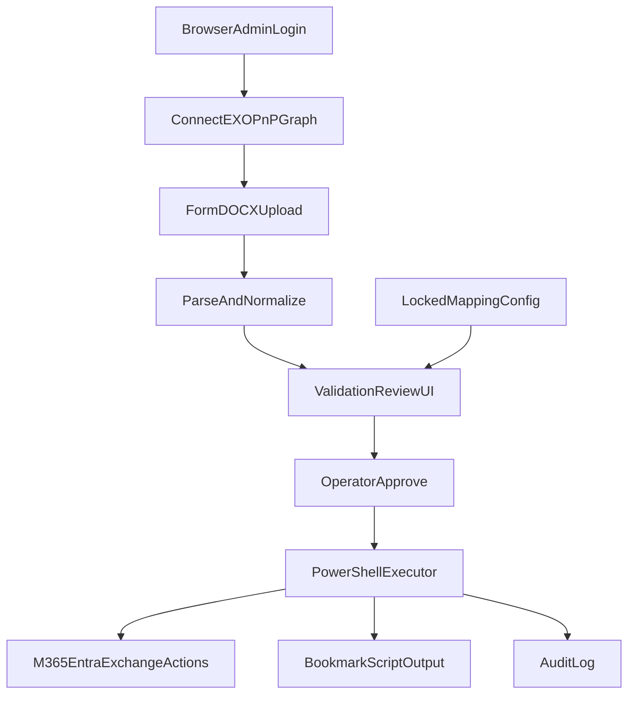

# Build Plan: New User Form Automation

## Recommended Platform
- Build a **Windows desktop app** using **.NET 8 + WPF** for GUI and **PowerShell 7 runspaces** for Microsoft 365 actions.
- Rationale: best fit for your small IT team, secure local execution of admin scripts, strong validation UX, and straightforward packaging.

## What We Parsed From The Form
- Input includes identity, licensing, mailbox/shared mailbox access, SharePoint folder access, phone/call queue, app/bookmark requirements, and approval metadata from `[c:\Users\KyleBoland\OneDrive - Emerald Group\Desktop\newusercreationtool\NB Emerald New Employee Form.docx](c:\Users\KyleBoland\OneDrive - Emerald Group\Desktop\newusercreationtool\NB Emerald New Employee Form.docx)`.
- Key examples to support in v1: preferred username/password, primary/secondary emails, business standard/mailbox license fields, multi-select mailbox/folder lists, and free-text special requirements.

## v1 Scope (Based On Your Decisions)
- **Directory target:** Entra ID / Microsoft 365 cloud only.
- **Automation included:**
  - Create user + set UPN/password + assign license(s)
  - Apply group/shared mailbox/SharePoint access via mapping and rules
  - Generate browser/bookmark setup script output
- **Not automated in v1:** Teams call queue changes and device provisioning (can be added later).

## Functional Design
- **Step 0 Tenant Admin Authentication**
  - Prompt operator with browser-based interactive sign-in before execution.
  - Establish authenticated sessions for `ExchangeOnlineManagement`, `PnP.PowerShell`, and `Microsoft.Graph` (as required by selected actions).
  - Validate tenant context (tenant ID/domain) and required scopes/roles before enabling `Execute`.
- **Step 1 Upload & Parse**
  - Upload `.docx` and extract fields into structured JSON.
  - Normalize noisy values (`Yes/no`, smart quotes, odd symbols, mixed delimiters).
- **Step 2 Validation & Review**
  - Show a review grid with field status badges: `Valid`, `Warning`, `Needs Fix`.
  - Run actionable checks (UPN format, license SKU availability, resolvable group/mailbox targets).
  - Allow inline correction before execution.
- **Step 3 Mapping Layer (Locked Config)**
  - Maintain IT-managed locked config mapping form labels/names to M365 targets.
  - Example: form value `HR ADMIN` -> actual M365 group/display ID.
- **Step 4 Approval & Execute (Hybrid Safety)**
  - Auto-prepare low-risk actions; require explicit operator confirmation for high-risk actions.
  - Display execution progress per command and failure reason with retry for failed items.
- **Step 5 Audit & Outputs**
  - Write immutable audit records: operator, timestamp, input snapshot hash, commands run, outcomes.
  - Export final onboarding summary plus generated bookmark/profile script.

## Security Model
- Small IT team sign-in with named users.
- Role split: `Operator` (run onboarding) and `Config Admin` (edit locked mappings).
- Store secrets in Windows Credential Manager/DPAPI; never plaintext in config.
- Use delegated interactive auth with browser prompts for tenant admin sign-in and least-privilege consented scopes.

## Minimum Permissions Baseline (v1)
- **Microsoft Graph delegated scopes (initial target):**
  - `User.ReadWrite.All` (create/update users)
  - `Group.ReadWrite.All` (group membership updates)
  - `Directory.Read.All` (directory lookups and validation)
  - `Organization.Read.All` (tenant validation checks)
- **Exchange Online role requirement (delegated):**
  - Assign operators to a least-privilege custom role group for mailbox permission tasks.
  - Typical minimum includes rights equivalent to mailbox recipient management plus mailbox permission assignment only.
- **PnP/SharePoint requirement (delegated):**
  - Site-level role sufficient to grant access on target SharePoint sites/folders only.
  - Prefer scoping operators to specific onboarding sites rather than tenant-wide SharePoint admin where possible.
- **Module connection policy:**
  - Connect only required modules per selected actions (do not request all scopes by default).
  - Cache session tokens for current run only; force re-auth on sign-out or session expiry.
  - Block execution when required scope/role is missing and surface corrective guidance.

## Permission Hardening Approach
- Start with the above baseline in pilot and record which commands actually require elevation.
- Reduce granted scopes/roles after pilot by removing unused permissions.
- Keep a command-to-permission matrix in config so validation can pre-check access before execution.
- Require explicit approval before enabling any additional privileged action beyond v1 scope.

## Core Artifacts To Build
- Desktop app project (WPF)
- PowerShell orchestration module (Exchange Online, PnP, Graph cmdlets)
- Locked mapping config (e.g., signed JSON)
- Validation rule engine
- Audit log store (local DB or append-only file)
- Bookmark script generator
- Auth/session manager for interactive browser login and module connection health
- UX component library (consistent inputs, badges, banners, progress, dialogs)

## UI Blueprint (Screen-by-Screen)
- **Screen 1 - Sign In**
  - Primary CTA: `Sign in to tenant`.
  - Show connected status per module: `Exchange`, `PnP`, `Graph`.
  - Prevent moving forward until required connections/scopes are valid.
- **Screen 2 - Upload Form**
  - Drag-and-drop zone + file picker for `.docx`.
  - Show parse result summary: detected employee, date, sections found.
  - Inline warning if expected sections are missing.
- **Screen 3 - Review And Fix**
  - Three-pane layout:
    - Left: section navigation (`Identity`, `Licenses`, `Mailbox`, `SharePoint`, `Bookmarks`)
    - Center: editable fields
    - Right: live action preview of what will run
  - Field status badges: `Valid`, `Warning`, `Needs Fix`.
  - One-click suggestions for mapped names (group/mailbox/sharepoint target resolution).
- **Screen 4 - Pre-Run Confirmation**
  - Final checklist of actions grouped by risk (`Low`, `Elevated`).
  - Require explicit confirmation for elevated actions.
  - Display exact target tenant and operator account before execution.
- **Screen 5 - Execution**
  - Step runner with per-action states: `Queued`, `Running`, `Succeeded`, `Failed`, `Skipped`.
  - Expandable details panel shows command intent and any error guidance.
  - Retry only failed non-destructive actions.
- **Screen 6 - Summary**
  - Clear outcome totals and audit reference ID.
  - Exportable summary (for manager/requester communication).
  - Generated bookmark/profile script download or copy action.

## UX Standards To Avoid Clunkiness
- Keep one primary action button per screen; no competing CTAs.
- Keep wording aligned with the original form labels where practical.
- Use progressive disclosure: show advanced technical details only on demand.
- Disable `Run` until all blocking issues are resolved.
- Show errors next to fields with direct fix suggestions, not generic popups.
- Preserve edits and session state when moving between screens.
- Use consistent keyboard navigation and tab order for rapid IT operator use.
- Target response times:
  - Parse and validate under 3 seconds for typical forms.
  - Screen transitions under 150 ms.
  - Status updates during execution every 1-2 seconds.

## UX Validation Plan
- Run 5 representative onboarding scenarios from real historical forms.
- Conduct 2-pass operator testing:
  - Pass 1: first-time users (measure confusion points and completion time)
  - Pass 2: power users (measure speed and clicks)
- Track metrics:
  - Time to complete request
  - Number of correction loops per form
  - Failed run rate
  - Post-run manual rework required
- Add a lightweight in-app feedback prompt on summary screen for continuous improvement.

## High-Level Flow

## Delivery Phases
- **Phase 1:** Parser + review UI + mapping config + dry-run command preview
- **Phase 2:** Live execution (user/license/group/mailbox/sharepoint) + audit trail
- **Phase 3:** Hardening (packaging, RBAC refinements, reporting, retries/rollback guidance)

## Acceptance Criteria
- DOCX fields parse into expected schema with >95% success on known forms.
- Any unresolved group/mailbox/folder entry is blocked until corrected or mapped.
- Execution screen shows per-step success/failure and produces auditable summary.
- Locked mapping changes are restricted to config admins and fully logged.
- Browser-based tenant admin sign-in successfully connects required modules (EXO/PnP/Graph) before execution starts.
- Preflight rejects execution when Graph scopes, EXO roles, or PnP site rights are insufficient for selected actions.
- Permission audit log records requested modules/scopes, granted scopes, and operator identity for each run.
- Operators can complete a standard onboarding request end-to-end without guidance in a single pass.
- At least 90% of pilot runs require no backtracking across screens after the review stage.
